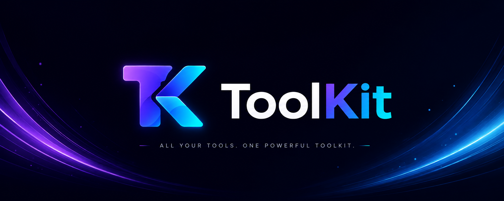

# ToolKit

A collection of 69+ fast, reliable, and privacy-first client-side utilities for developers, designers, and makers. Built by **Anand Binu Arjun**.



## Features

- **69+ Utilities**: Encoders, formatters, generators, design tools, and more.
- **100% Client-Side**: No data ever leaves your browser. All processing happens locally for maximum privacy.
- **Premium Design**: Built with Next.js, Tailwind CSS, and `framer-motion` for a smooth, app-like experience.
- **Offline Ready**: Fully progressive web app (PWA) support. Tools work even without an internet connection.
- **Favorites & Recents**: Pin your favorite tools and easily access your recently used tools, saved securely in `localStorage`.
- **Command Palette**: Press `Cmd/Ctrl + K` to instantly search and navigate between tools, with category filtering support.

## Getting Started

First, run the development server:

```bash
npm run dev
# or
yarn dev
# or
pnpm dev
# or
bun dev
```

Open [http://localhost:3000](http://localhost:3000) with your browser to see the result.

## Tech Stack

- [Next.js](https://nextjs.org) (App Router, Static Export)
- [Tailwind CSS](https://tailwindcss.com)
- [Framer Motion](https://www.framer.com/motion/)
- [Lucide Icons](https://lucide.dev)
- [shadcn/ui](https://ui.shadcn.com/)

## License & Credits

Built by [Anand Binu Arjun](https://abarjun.online) | [GitHub](https://github.com/AnandBinuArjun)
